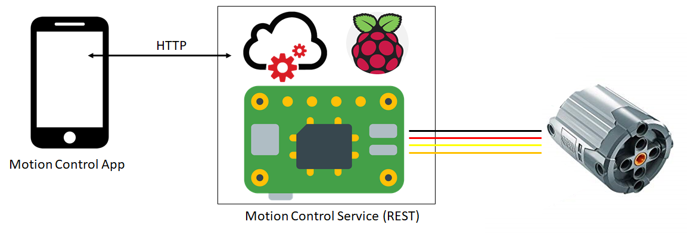

# Motion Control Server (java)

let's control our LEGO (tm) bricks with the Raspberry Pi
controller! This projekt provides a server that can run
onto the Raspi and offer a rest-service to control the actors
of your LEGO (tm) construction.

NOTE: there is an android app here have an easy-to-use
access of the REST-API of the Motion Control Server.

## Big Picture

## Details

The `Motion Control Server` offers an REST API that lets you
send steering signals to the Raspi. These steering signals are
processed by the Raspi and the corresponding Pins are set.
